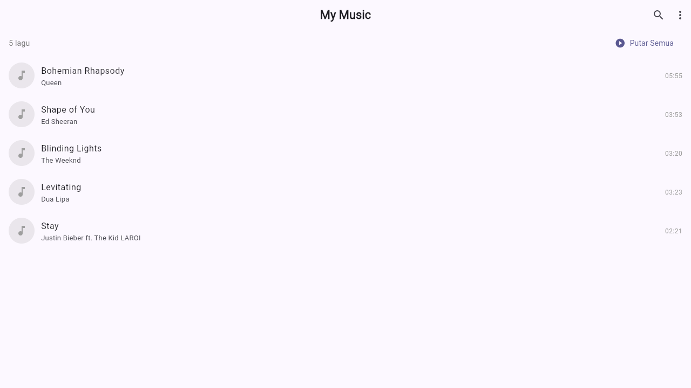

# 🎵 Flutter Media Player

Aplikasi pemutar musik sederhana berbasis Flutter, dibuat sebagai proyek mata kuliah **Pemrograman Mobile**.

---

## 📋 Daftar Isi

- [Tentang Proyek](#tentang-proyek)
- [Fitur Aplikasi](#fitur-aplikasi)
- [Arsitektur & Pola Desain](#arsitektur--pola-desain)
- [Struktur Folder](#struktur-folder)
- [Teknologi & Package](#teknologi--package)
- [Cara Menjalankan](#cara-menjalankan)
- [Penjelasan Kode](#penjelasan-kode)
- [Alur Kerja Aplikasi](#alur-kerja-aplikasi)

---

## 📸 Screenshot



---

## 📖 Tentang Proyek

Proyek ini adalah implementasi aplikasi pemutar media (music player) menggunakan framework Flutter. Tujuan utama proyek ini adalah mempelajari:

- Arsitektur MVC pada Flutter
- Manajemen state menggunakan Provider
- Penggunaan package pihak ketiga (just_audio)
- Desain UI yang responsif dan menarik
- Animasi dan transisi halaman

---

## ✨ Fitur Aplikasi

| Fitur | Deskripsi |
|-------|-----------|
| 🎵 Daftar Lagu | Menampilkan semua lagu dalam format list |
| ▶️ Play / Pause | Kontrol dasar pemutaran |
| ⏭️ Next / Previous | Navigasi antar lagu |
| 🔄 Repeat Mode | None → One → All |
| 🔀 Shuffle | Mode acak lagu |
| 📊 Progress Bar | Slider durasi dengan seek |
| 🔍 Pencarian | Filter lagu berdasarkan judul/artis |
| 📱 Mini Player | Kontrol kecil di halaman utama |
| 💿 Album Art | Gambar cover berputar saat play |
| 🌙 Dark Mode | Tema gelap otomatis |

---

## 🏗️ Arsitektur & Pola Desain

Proyek ini menggunakan **Arsitektur MVC (Model-View-Controller)** yang diimplementasikan dengan **Provider Pattern**:

```
┌─────────────────────────────────────────────┐
│                   USER                       │
│           (Berinteraksi dengan UI)           │
└──────────────────┬──────────────────────────┘
                   │ tap/gesture
                   ▼
┌─────────────────────────────────────────────┐
│                   VIEW                       │
│  (HomeScreen, PlayerScreen, Widgets)         │
│  • Menampilkan data ke pengguna              │
│  • Menerima input dari pengguna              │
│  • Memanggil method di Controller            │
└──────────────────┬──────────────────────────┘
                   │ calls method
                   ▼
┌─────────────────────────────────────────────┐
│               CONTROLLER                     │
│  (PlayerController extends ChangeNotifier)   │
│  • Mengandung logika bisnis                  │
│  • Mengatur AudioPlayer                      │
│  • notifyListeners() → update UI             │
└──────────────────┬──────────────────────────┘
                   │ read/write
                   ▼
┌─────────────────────────────────────────────┐
│                  MODEL                       │
│  (SongModel)                                 │
│  • Struktur data lagu                        │
│  • Validasi & transformasi data              │
└─────────────────────────────────────────────┘
```

---

## 📁 Struktur Folder

```
flutter_media_player/
│
├── lib/                          # Kode Dart utama
│   ├── main.dart                 # Entry point aplikasi
│   │
│   ├── models/                   # Layer Model
│   │   └── song_model.dart       # Struktur data lagu
│   │
│   ├── controllers/              # Layer Controller
│   │   └── player_controller.dart # Logika pemutar + state
│   │
│   ├── views/                    # Layer View (Halaman)
│   │   ├── splash_screen.dart    # Halaman loading awal
│   │   ├── home_screen.dart      # Daftar lagu
│   │   └── player_screen.dart    # Halaman pemutar
│   │
│   ├── widgets/                  # Komponen UI reusable
│   │   ├── song_tile.dart        # Item lagu di list
│   │   ├── player_controls.dart  # Tombol kontrol
│   │   ├── album_art_widget.dart # Gambar album
│   │   ├── progress_bar_widget.dart # Slider progress
│   │   └── mini_player.dart      # Mini player
│   │
│   ├── theme/
│   │   └── app_theme.dart        # Konfigurasi tema warna
│   │
│   └── utils/
│       └── format_utils.dart     # Fungsi utilitas
│
├── test/                         # Unit tests
│   └── player_controller_test.dart
│
├── android/                      # Konfigurasi Android
│   └── app/src/main/
│       └── AndroidManifest.xml   # Izin & konfigurasi app
│
├── assets/                       # Aset statis
│   ├── audio/                    # File audio .mp3
│   └── images/                   # Gambar cover album
│
├── docs/                         # Dokumentasi
│   ├── ARCHITECTURE.md           # Penjelasan arsitektur
│   ├── API_REFERENCE.md          # Referensi kelas & method
│   └── FLOWCHART.md              # Diagram alur
│
└── pubspec.yaml                  # Konfigurasi & dependencies
```

---

## 📦 Teknologi & Package

### Framework
| Teknologi | Versi | Keterangan |
|-----------|-------|------------|
| Flutter | ^3.0.0 | Framework UI cross-platform |
| Dart | ^3.0.0 | Bahasa pemrograman |

### Package Dependencies
| Package | Versi | Fungsi |
|---------|-------|--------|
| `just_audio` | ^0.9.36 | Engine pemutaran audio |
| `provider` | ^6.1.1 | Manajemen state (MVC Controller) |
| `on_audio_query` | ^2.9.0 | Membaca lagu dari storage |
| `permission_handler` | ^11.1.0 | Meminta izin storage |
| `animations` | ^2.0.8 | Animasi Material Design |

---

## 🚀 Cara Menjalankan

### Prasyarat
Pastikan sudah terinstall:
- Flutter SDK (versi 3.x ke atas)
- Android Studio / VS Code
- Android Emulator atau perangkat fisik

### Langkah-langkah

**1. Clone atau ekstrak proyek:**
```bash
cd flutter_media_player
```

**2. Install dependencies:**
```bash
flutter pub get
```

**3. Periksa setup Flutter:**
```bash
flutter doctor
```

**4. Jalankan aplikasi:**
```bash
# Mode debug (development)
flutter run

# Mode release (production)
flutter run --release
```

**5. Build APK:**
```bash
flutter build apk --release
# Output: build/app/outputs/flutter-apk/app-release.apk
```

**6. Jalankan unit test:**
```bash
flutter test
```

---

## 📝 Penjelasan Kode

### 1. `SongModel` — Struktur Data

```dart
class SongModel {
  final int id;       // ID unik
  final String title; // Judul lagu
  final String artist; // Nama artis
  final Duration duration; // Durasi lagu
  // ...
}
```

Model ini merepresentasikan satu buah lagu. Menggunakan `final` agar immutable (tidak bisa diubah setelah dibuat), sesuai prinsip functional programming.

### 2. `PlayerController` — Logika Bisnis

```dart
class PlayerController extends ChangeNotifier {
  final AudioPlayer _audioPlayer = AudioPlayer();
  
  Future<void> playSong(int index) async {
    await _audioPlayer.setAsset(song.filePath);
    await _audioPlayer.play();
    notifyListeners(); // Memberitahu UI untuk rebuild
  }
}
```

`ChangeNotifier` memungkinkan controller "memberitahu" semua widget yang mendengarkan bahwa state telah berubah.

### 3. `Provider` — Menghubungkan Controller ke UI

```dart
// Di main.dart: mendaftarkan controller
MultiProvider(
  providers: [
    ChangeNotifierProvider(create: (_) => PlayerController()),
  ],
)

// Di widget: mengakses controller
Consumer<PlayerController>(
  builder: (context, playerCtrl, _) {
    return Text(playerCtrl.currentSong?.title ?? '');
  }
)
```

---

## 🔄 Alur Kerja Aplikasi

```
Aplikasi Dibuka
      │
      ▼
SplashScreen (2.5 detik)
      │
      ▼
HomeScreen ─── PlayerController.playlist
      │         (menampilkan daftar lagu)
      │
      │ [User tap lagu]
      ▼
PlayerController.playSong(index)
      │
      ├── AudioPlayer.setAsset(path)
      ├── AudioPlayer.play()
      └── notifyListeners() ──► UI rebuild
      │
      ▼
PlayerScreen
      │
      ├── AlbumArtWidget (berputar)
      ├── ProgressBarWidget (update tiap detik)
      └── PlayerControls
            │
            ├── [Tap Pause] → pause() → notifyListeners()
            ├── [Tap Next]  → next()  → playSong(index+1)
            └── [Seek bar]  → seekTo(position)
```

---

## 👨‍💻 Informasi Proyek

- **Mata Kuliah:** Pemrograman Mobile
- **Framework:** Flutter / Dart
- **Pola Arsitektur:** MVC + Provider
- **Platform:** Android (iOS support tersedia)

---

## 📚 Referensi

- [Flutter Documentation](https://flutter.dev/docs)
- [just_audio Package](https://pub.dev/packages/just_audio)
- [Provider Package](https://pub.dev/packages/provider)
- [Material Design 3](https://m3.material.io/)
